Ce présent dossier contient les deux simulations du G5E pour l'Etat de l’Art à propos des Accéléromètres Industriels (MEMS et autres)

------

# Rapport sur les simulations

Vous trouverez le rapport sur les simulations ici :
[Rapport sur les simulations](Etat_de_l_Art___Simulation.pdf)


-------------


## Simulation 1

_Construction d'un dispositif pour mesurer l'accélération linéaire à l'aide d'un accéléromètre._ Pour cette simulation, nous avons utilisé un accéléromètre MEMS. Dans le cas de l'utilisation de ce capteur nous avons utilisé l'application "Physics Toolbox Suite" qui enregistre en temps réel les données de l'accéléromètre implémenté dans un smartphone.
    
_Montée dans un ascenseur et effectuer des mesures d'accélération linéaire à différents moments de la montée ou de la descente._ Pour cette étape, nous sommes montés dans un ascenseur et avons effectué des mesures d'accélération linéaire lors de la montée ou de la descente de celui-ci. Nous avons enregistré les données en utilisant un smartphone.
    
_Analyse des données pour déterminer la vitesse de l'ascenseur au cours du temps._ Pour cette étape, nous allons utiliser un logiciel de traitement de données (MATLAB ainsi que Python) pour analyser les données et déterminer la vitesse de l'ascenseur au cours du temps. Nous allons tracer un graphique de l'accélération en fonction du temps pour visualiser les résultats qui en découlent.


Nous avons utilisé l’application "Physics Toolbox Suite" pour enregistrer les varia-
tion de l’accélération de la pesanteur à la surface de la Terre en fonction du temps lors
de la montée d’un ascenseur sur 3 étages. Nous avons dans un premier temps analysé
ce tableau pour en déduire les données qui nous intéressaient.

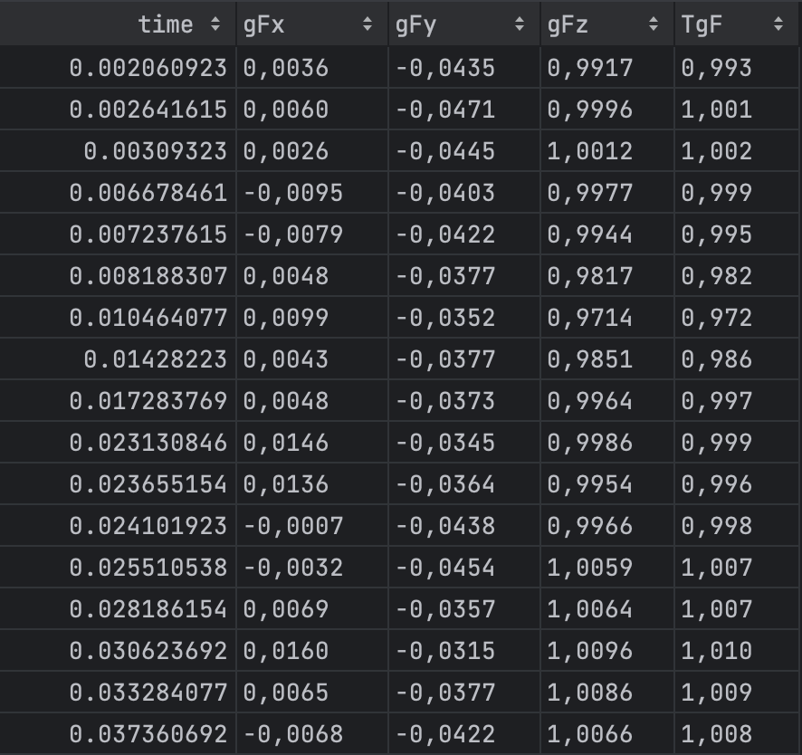


Comme nous pouvons le remarquer dans ce tableau, la première colonne nous permet de définir l’instant où la mesure a été prise. Les autres colonnes sont respectivement
l’accélération en x, en y, en z et la somme de ces forces. Dans le cadre de cette expérience nous souhaitons analyser les variations de l’accélération par rapport à l’axe z. La
somme totale des forces ne serait pas intéressante car l’ascenseur ayant une trajectoire
purement verticale, cela ne ferait qu’ajouter du bruit à nos valeurs.

Nous n’allons donc garder que le temps et la mesure de l’accélération en z que nous
allons afficher sur un graphique pour une meilleure visualisation du jeu de données.


Dans un premier temps, nous avons fait notre simulation sur le logiciel MATLAB.
Une fois le jeu de données chargé, nous obtenons le graphique suivant :

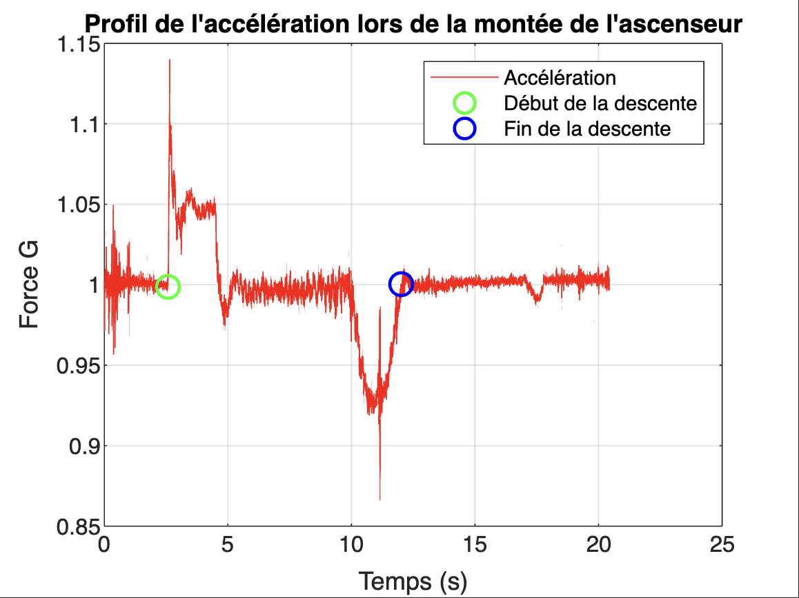

Sur ce graphique, nous remarquons par analyse graphique une augmentation
de l’accélération de 2,5 secondes à 5 seconde, une stabilisation pendant 5 secondes, et
une décélération durant 2,5 secondes. Nous allons donc diviser notre programme en
3 parties distinctes : la phase d’accélération, la phase de vitesse constante, et la phase
de décélération. Pour que notre algorithme soit juste, nous avons défini une vitesse de
départ et d’arrivée à 0 m/s. Nous en déduisons le graphique suivant :

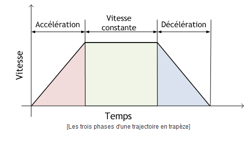


Nous avons fait une moyenne de l’accélération que nous avons préalablement multipliée par l’accélération de la pesanteur standard que nous avons notée "g", pour
convertir nos valeurs en accélération. Nous avons pris pour nos analyses une valeur de g
de 9, 81 m/s^2.

Une fois ces moyennes calculées, nous pouvons en déduire la vitesse maximale atteinte à la suite de l’accélération qui est donnée par :

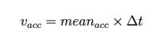

Nous pouvons ensuite en déduire la distance parcourue par l’ascenseur en calculant
la distance parcourue lors de l’accélération, lors de la phase durant laquelle la vitesse
est constante, et durant la décélération. Nous restons dans le cas où la vitesse à l’origine
est 0 m/s.

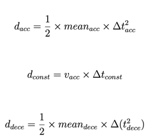

Nous obtenons après ces calculs les résultats suivant lors de l’analyse de la montée
d’un ascenseur sur 3 étages :

```

L'accélération est positive de 2.57 s à 4.62 s avec une accélération moyenne de 0.47 m/s^2
L'accélération est negative de 10.04 s à 12.00 s avec une deceleration moyenne de -0.49 m/s^2

On en déduit une accélération pendant 1.96 m à une vitesse de 0.95 m/s
On en déduit une deceleration pendant 1.89 m à une vitesse de 0.96 m/s

La distance parcourue entre l'accélération et la décélération est calculée par x(t)=v1*t+x0
Elle est de 5.17 m

Ce qui fait un total de 9.02 m en 9.43 s

```

Une fois ce programme réalisé et cohérent avec l’expérience, nous avons décidé de
l’implémenter aussi en Python. Nous obtenons les mêmes résultats

#### Nous obtenons ce graphique :

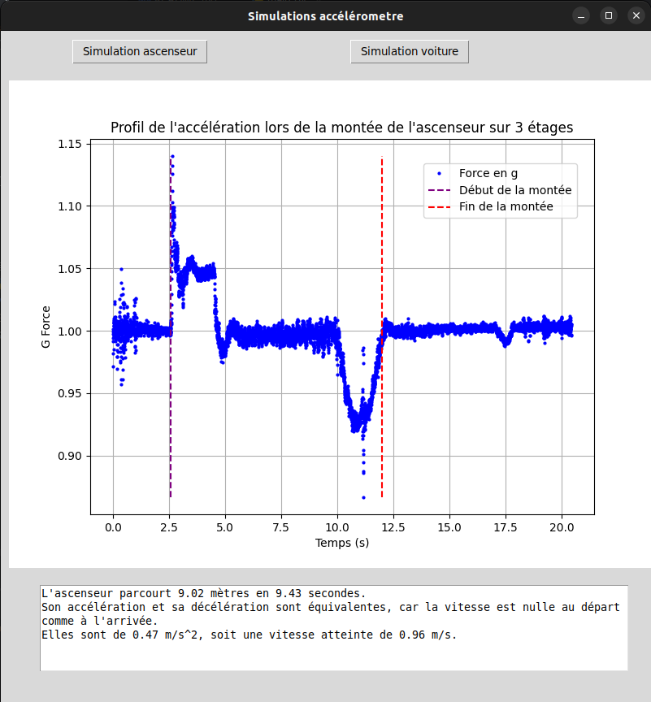


Pour conclure cette simulation, nous pouvons dire que l’accéléromètre utilisé semble
avoir une bonne précision car nous sommes dans le bon ordre de grandeur. Cette simulation met en évidence les variations de l’accélération subie par les passagers, ce
programme pourrait aussi permettre de détecter des anomalies telles que des accélérations trop brusques, des secousses ou des vibrations. De plus, nous remarquons qu’un
ascenseur n’a pas d’accélération linéaire jusqu’à sa décélération et son arrêt, mais une
vitesse limite (0,96 m/s) atteinte en 2,5 secondes.


Il aurait été intéressant de comparer les différents profils d’ascenseur, sur un nombre
différent d’étages. De plus, nous aurions aussi pu analyser le profil d’accélération d’un
ascenseur lors de sa descente pour en tirer des conclusions quant au fonctionnement de
celui-ci.


## Simulation 2

Pour cette simulation, nous avons fixé un accéléromètre à l'intérieur d'une voiture pour que celui-ci ne bouge plus par rapport au référentiel de la voiture. Nous avons ensuite effectué des mesures d'accélération linéaire en conduisant la voiture à plusieurs accélérations différentes : de 0 à 30 km/h, de 0 à 45 km/h et de 0 à 80km/h.
    
Pour cette étape, nous avons développé un programme Python pour analyser les données relevé et déterminer la vitesse de la voiture au cours du temps. Nous avons donc tracé un graphique de la vitesse en fonction du temps pour visualiser les résultats et les analyses qui en découlent.


### Analyse des résultats :

Pour notre deuxième simulation, nous nous sommes intéressés au profil de l’accélération d’une voiture d’une vitesse nulle à une vitesse choisie. Le but de cette simulation
est de pouvoir analyser la variation de la vitesse d’une voiture et en déduire sa linéarité, l’impact de changements extérieurs sur la vitesse, et la précision du compteur de
la voiture.
Nous avons donc mesuré trois accélérations : 30, 45, et 80 km/h. Lors de notre expérience, nous avions une vitesse nulle à l’origine sur une route plate.


Dans un premier temps, nous avons, comme lors de la première expérience, choisi les données à analyser. Durant l’expérience, le téléphone était horizontal et orienté
vers l’avant de la voiture, ainsi, l’accélération est à analyser sur l’axe y.
Pour commencer cette simulation, nous avons fait un enregistrement de plusieurs secondes de la voiture, moteur allumé à l’arrêt, pour pouvoir calibrer notre expérience
et en déduire l’équation du bruit subit par l’accéléromètre.

Nous avons donc commencé par calculer l’accélération instantanée en multipliant
toutes les valeurs par "g". Nous avons ensuite calculé la vitesse instantanée en
suivant le même protocole que lors de la phase d’accélération lors de la phase de montée
de l’ascenseur.

Nous en déduisons donc les courbes de la vitesse mesurée en fonction du temps et
la position de la voiture par rapport au point de départ.
Le premier enregistrement représente l’accélération d’une voiture de 0 à 30 km/h :

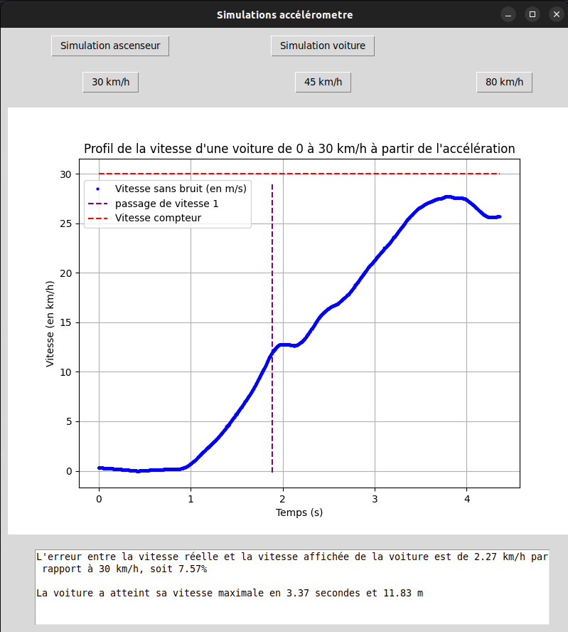

Par analyse graphique, nous remarquons que la vitesse réelle atteinte n’est pas 30
km/h mais 27,7 km/h, ce qui représente un écart de 7.57% par rapport à la vitesse
souhaitée. De plus, comme l’expérience a été faite avec une voiture à boîte mécanique, nous pouvons remarquer un plateau sur la courbe qui traduit un passage de rapport
de vitesse. Le passage de rapport de vitesse a été déterminé par le code, car celui-ci
est d’autant plus visible sur la courbe de l’accélération. En effet, nous remarquons une
chute de l’accélération à 0m/s2 qui décrit le passage de vitesse.

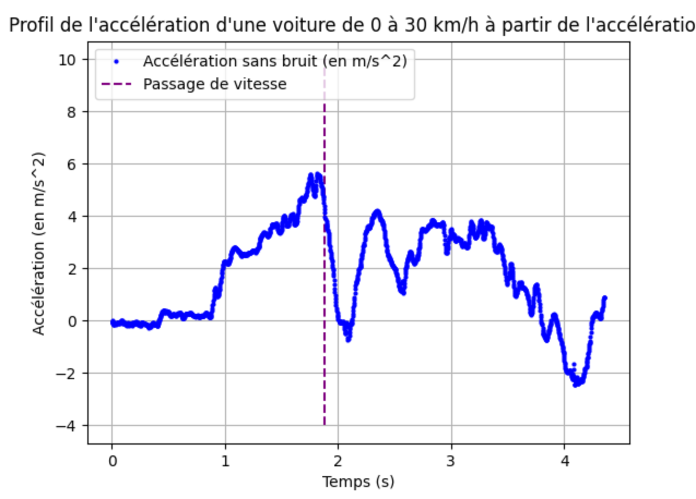

Nous avons ensuite enregistré une accélération jusqu’à 45 km/h.

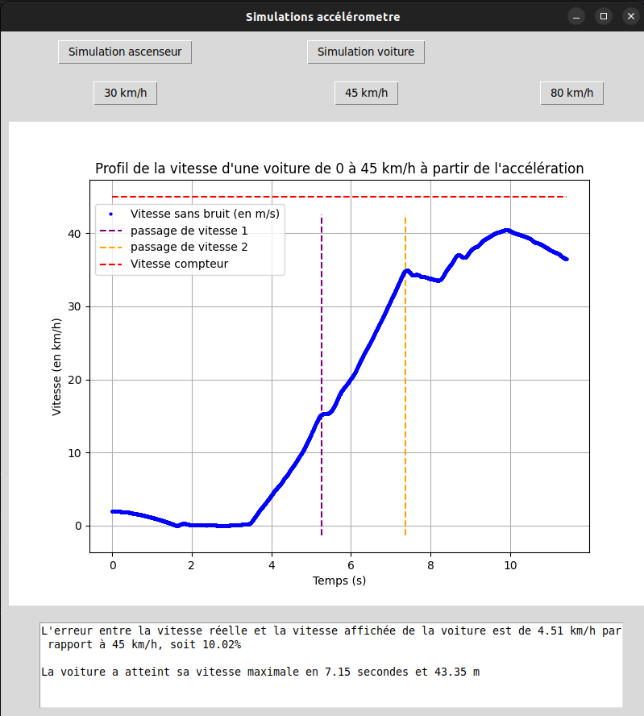

Comme lors de l’accélération de 0 à 30 km/h, nous avons une augmentation linéaire
de la vitesse. Nous avons aussi une différence entre la vitesse mesurée et la vitesse du
compteur de la voiture. Dans cette simulation, il est de 10% avec une vitesse réelle
atteinte à 40,5 km/h. Par analyse graphique, nous remarquons quelque chose d’intéressant : le premier passage de vitesse a la même allure que le passage de vitesse lors de la
première expérience, tandis ce que le deuxième passage de vitesse en jaune sur le graphe
15 a une allure vraiment différente. En effet, nous remarquons un plateau nettement
plus long, avec une perte de vitesse et un petit rebond une fois la vitesse enclenchée.
Cela s’explique par différentes choses : la distance parcourue par le levier de vitesse
entre la deuxième et la troisième vitesse, et les frottements qui dépendent de la formule
suivante :

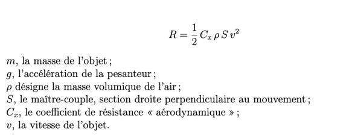


La vitesse est donc exprimée au carré, nous en déduisons que la voiture subit quatre
fois plus de frottements à 35km/h qu’à 15 km/h. De plus il faut prendre en compte les
frottements des pièces mécaniques de la voiture.
Pour la troisième expérience, nous avons élancé la voiture jusqu’à 80km/h. La voiture n’a subi qu’un seul passage de vitesse, de la vitesse numéro 2 à la vitesse numéro 3. Nous obtenons le graphique suivant :

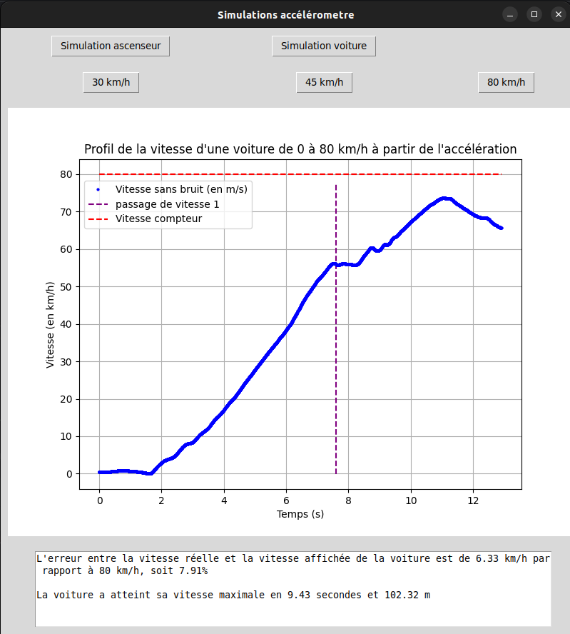


Par analyse graphique, nous remarquons que le passage de vitesse a les mêmes caractéristiques que le passage équivalent lors de la dernière analyse. Nous remarquons que
la variation de vitesse est linéaire sur l’ensemble de l’accélération. Une fois la vitesse
maximum atteinte, nous avons arrêté d’appuyer sur l’accélérateur et nous remarquons
les frottements subis à cette vitesse qui sont trois à quatre fois supérieurs que lors
des expériences précédentes. Nous pouvons aussi noter la différence de vitesse entre
la vitesse lue sur le compteur et la vitesse maximale enregistrée. Nous avons ici une
différence de 8%.

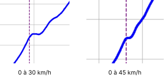

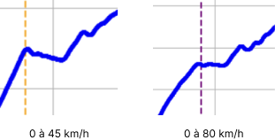


Ces deux figures, nous montrent qu’il y a potentiellement une corrélation
entre la conception des pièces mécaniques de la boite de vitesse et les performances de
la voiture. Cela pourrait être important et pris en compte notamment dans le milieu
du sport automobile.


Il faut aussi prendre en compte la conception d’un levier de vitesse. En effet, la
distance entre la vitesse une et la vitesse deux est plus courte que la distance entre la
vitesse deux et la vitesse trois. Cela peut aussi expliquer le temps de passage qui est
plus long dans le deuxième cas. Comme montré sur le graphique ci-dessous, la flèche rouge montre
le chemin emprunté par le levier lors du passage de la vitesse une à la vitesse deux. Et
la flèche bleue montre le chemin emprunté par le levier lors du passage de la vitesse
deux à la vitesse trois. Cela met en évidence la différence de temps entre les différents
passages de vitesse observés dans les différents jeux de données.


À la suite de ces trois expériences, nous pouvons calculer le taux d’erreur moyen
entre la vitesse enregistrée et le compteur.

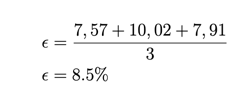


Nous avons donc une erreur moyenne de 8,5% alors que le constructeur annonce une
erreur de 5%. Nous en déduisons même si nos mesures sont précises à 3,5%. De plus
il aurait été intéressant d’effectuer plusieurs fois les mesures dans les mêmes conditions
afin de pouvoir comparer les différents jeux de données.
Pour conclure cette simulation, nous pouvons dire que la mesure de l’accélération
nous a permis de déterminer les différents passages de vitesse ainsi que leur effet sur
l’accélération de la voiture. Nous avons aussi pu mesurer la précision des outils de
mesure présents à bord. Les accéléromètres présents dans la voiture ont néanmoins de
nombreux usages tels que la détection d’accident, ou de freinage brusque, mais aussi
d’anomalies qui ne peuvent pas être ressenties par les utilisateurs comme un profil de
passage de vitesse anormal.

```
L'erreur entre la vitesse réelle et la vitesse affiché de la voiture et de 2.27 km/h par rapport à 30km/h , soit 7.57 %
La voiture a atteint sa vitesse maximale en 3.37 secondes et 11.83 m
 
L'erreur entre la vitesse réelle et la vitesse affiché de la voiture et de 4.51 km/h par rapport à 45km/h , soit 10.02 %
La voiture a atteint sa vitesse maximale en 7.15 secondes et 43.35 m
 
L'erreur entre la vitesse réelle et la vitesse affiché de la voiture et de 6.33 km/h par rapport à 80km/h , soit 7.91 %
La voiture a atteint sa vitesse maximale en 9.43 secondes et 102.32 m

```
