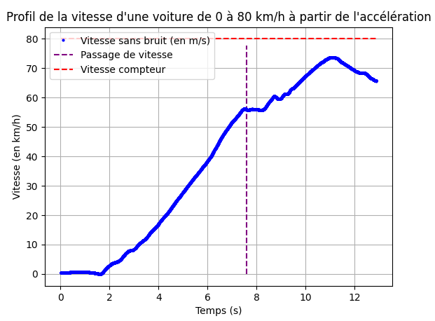

Ce présent dossier contient les deux simulations du G5E pour l'Etat de l’Art à propos des Accéléromètres Industriels (MEMS et autres)

## Simulation 1

_Construction d’un dispositif pour mesurer l’accélération linéaire à l’aide d’un
accéléromètre._ Pour cette simulation, nous pouvons utiliser un accéléromètre
MEMS. 

Dans le cas de l’utilisation de ce capteur, nous avons utilisé un smartphone pour enregistrer les données de l’accéléromètre.

Nous sommes monté dans un ascenseur pour effectuer des mesures d’accélération linéaire lors de la montée de celui-ci à l'aide d'une application sur smartphone.

Nous avons utilisé un logiciel de traitement de données (MATLAB) et un code python équivalent pour analyser les données et déterminer la vitesse de l’ascenseur au cours
du temps. Nous avons tracé un graphique de l'accélération en fonction du temps pour visualiser les résultats.

#### Nous avons obtenu les résultats suivants :

```

L'accélération est positive de 2.57 s à 4.62 s avec une accélération moyenne de 0.47 m/s^2
L'accélération est negative de 10.04 s à 12.00 s avec une deceleration moyenne de -0.49 m/s^2

On en déduit une accélération pendant 1.96 m à une vitesse de 0.95 m/s
On en déduit une deceleration pendant 1.89 m à une vitesse de 0.96 m/s

La distance parcourue entre l'accélération et la décélération est calculée par x(t)=v1*t+x0
Elle est de 5.17 m

Ce qui fait un total de 9.02 m en 9.43 s

```
#### Nous obtenons ce graphique :


## Simulation 2

_Fixation d’un accéléromètre à l’intérieur d’une voiture et utilisation pour mesurer
l’accélération linéaire de la voiture._ Pour cette simulation, vous avons fixé un
accéléromètre à l’intérieur d’une voiture pour que celui-ci ne bouge plus par
rapport au référentiel de la voiture. Nous avons ensuite effectué des mesures
d’accélération linéaire en conduisant la voiture dans différentes conditions de
conduite.

Nous avons effectué des mesures d’accélération linéaire jusqu'à différentes vitesses (ici, 30 km/h, 45 km/h, 80 km/h).

Nous avons ensuite analysé les données pour déterminer la vitesse de la voiture au cours du temps.
Pour cette étape, nous avons utilisé un programme python pour analyser les données et déterminer la vitesse de la voiture au cours
du temps. Nous allons tracer un graphique de la vitesse en fonction du temps
pour visualiser les résultats et les comparer à l'accélération.

#### Nous obtenons ces graphiques :


Nous pouvons observer une augmentation linéaire de la vitesse avec un plat lors d'un passage de vitesse de la boite mécanique de la voiture.
La voiture atteint la vitesse de 30km/h à 4 seconde après le début de l'enregistrement.


Comme lors de l'accélération de 0 à 30 km/h, nous avons une augmentation linéaire de la vitesse.
Avec un passage de vitesse entre 2 et 3 secondes et la vitesse de 50 km/h atteinte à partir de 5 secondes





Cette courbe est moins facile à analyser. En effet, on remarque une décélération à partir de 11 secondes où la vitesse de 80 km/h est atteinte, les frottements induisent ce début de chute de vitesse.
Nous voyons aussi un passage de vitesse à 8 seconde.


```
L'erreur entre la vitesse réelle et la vitesse affiché de la voiture et de 2.27 km/h par rapport à 30km/h , soit 7.57 %
La voiture a atteint sa vitesse maximale en 3.37 secondes et 11.83 m
 
L'erreur entre la vitesse réelle et la vitesse affiché de la voiture et de 4.51 km/h par rapport à 45km/h , soit 10.02 %
La voiture a atteint sa vitesse maximale en 7.15 secondes et 43.35 m
 
L'erreur entre la vitesse réelle et la vitesse affiché de la voiture et de 6.33 km/h par rapport à 80km/h , soit 7.91 %
La voiture a atteint sa vitesse maximale en 9.43 secondes et 102.32 m

```

#### Analyse

Grâce aux données d'accélération mesurée, nous avons réussi à déterminer une vitesse et une distance.
Elle nous permet de pouvoir analyser des changements d'environnement qui affectent directement la vitesse.
Grâce aux données d'accélération mesurée, nous avons réussi à en déterminer une vitesse et une distance correspondante. L'on remarque également qu'avec les trois mesures (pour la voiture) les passages de vitesses se font au même moment, tout comme les décélérations due aux changements de vitesses.
Ces mesures et variations nous permettent de déduire les changements d'environnements de l'objet en mouvement (ascenseur ou voiture). L'usage d'accéléromètre est massivement utilisé dans quasi toutes les études de mouvements d'objets, par exemple les navettes spatiales.

Cependant notre précision n'est bien évidemment pas parfaite. Nos mesures ont été faites avec un capteur piézoélectriques ou piézorésistifs (grandement présent dans les smartphones), et possèdent une grande sensibilité aux interférences électromagnétiques et aux variations, ainsi les résultats sont soumis à un taux d'erreur plus ou moins grand lié aux conditions d'enregistrement. Mais, au vue de nos résultats, l'erreur (si elle existe) est très petite.
Nous pouvons donc penser à des utilisations pour prédire ou prévenir de problèmes potentiels dus aux accélérations comprenant les chutes, les collisions, du stress sur les organes internes et l'inconfort pour les passagers. Des accélérations excessives peuvent également causer des dommages aux objets et mettre en danger la sécurité des personnes. Il est donc essentiel de respecter les normes de sécurité d’accélération pour prévenir ces risques.
